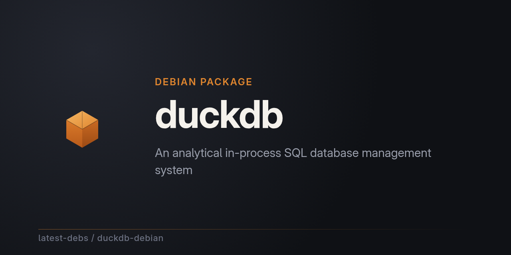

# duckdb for Debian

[duckdb](https://github.com/duckdb/duckdb) — an analytical in-process SQL
database management system — packaged for Debian as part of
[latest-debs](https://github.com/latest-debs).

## Install

Via the latest-debs apt repository:

```sh
sudo extrepo enable latest-debs
sudo apt update
sudo apt install duckdb
```

Or download a `.deb` from the [Releases](https://github.com/latest-debs/duckdb-debian/releases) page:

```sh
sudo dpkg -i duckdb_*.deb
```

## Supported distributions & architectures

- Debian Bookworm (12), Trixie (13), Forky (14/testing), Sid (unstable)
- amd64, arm64

  (duckdb's upstream CLI releases only publish amd64/arm64 Linux binaries)

## Building

Run the [Build duckdb for Debian](../../actions) workflow on GitHub with the
desired upstream version. Packaging is driven by
[debian-multiarch-builder](https://github.com/ranjithrajv/debian-multiarch-builder).

## Disclaimer

Unofficial packaging only. For issues with duckdb itself, see
[duckdb/duckdb](https://github.com/duckdb/duckdb).
